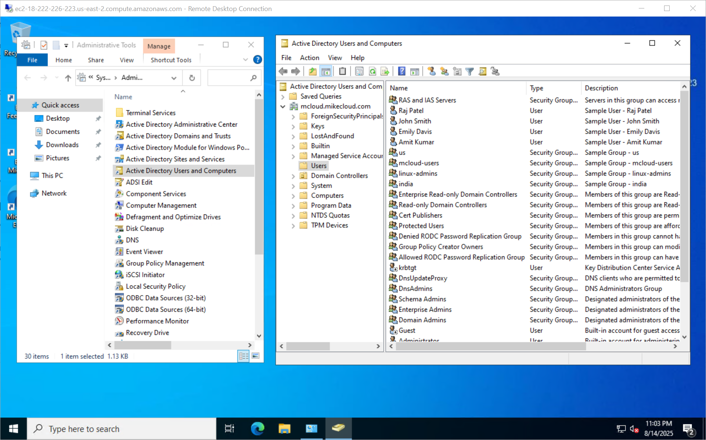
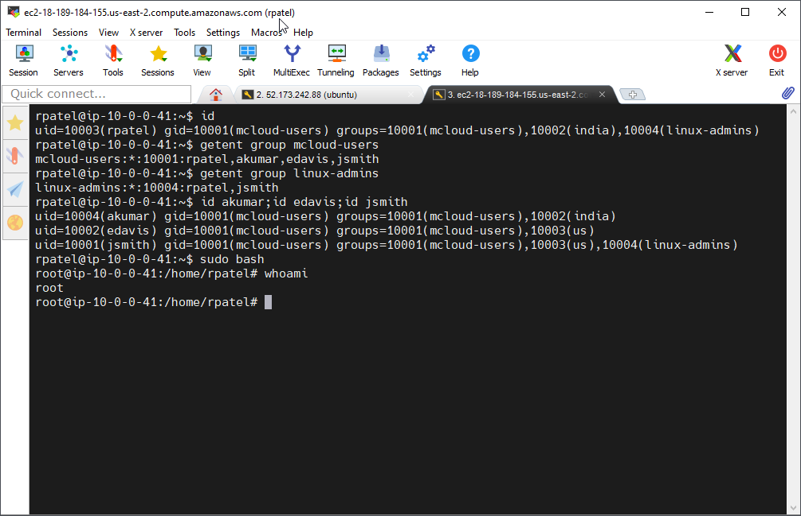

# AWS Directory Service

This is Part 1 of the Series: [Deploying Active Directory in the Cloud](https://youtu.be/H5lKJPJBL5s)

## Introduction

In this video, we will demonstrate the deployment of **AWS Directory Service**, a fully managed **Active Directory** solution in AWS, while covering the following tasks:  

- **Configure secure networking** by setting up subnets and security groups to allow domain connectivity.  
- **Deploy AWS Directory Service** within an Amazon VPC for seamless directory-aware workloads.  
- **Join both Windows and Linux servers** to the Active Directory domain.  
- **Configure SSSD** ([System Security Services Daemon](https://sssd.io/)) for Linux authentication with Active Directory.  
- **Integrate with AWS Secrets Manager** to securely store and retrieve administrator credentials.  
- **Manage directory objects and policies**, including users, groups, and Organizational Units (OUs).   
- **Clean up resources** by decommissioning all infrastructure provisioned during the process.  

This tutorial will help you understand **AWS Directory Service** and how to use it for **identity management in AWS environments**.


## Prerequisites

* [An AWS Account](https://aws.amazon.com/console/)
* [Install AWS CLI](https://docs.aws.amazon.com/cli/latest/userguide/getting-started-install.html) 
* [Install Latest Terraform](https://developer.hashicorp.com/terraform/install)

If this is your first time watching our content, we recommend starting with this video: [AWS + Terraform: Easy Setup](https://youtu.be/BCMQo0CB9wk). It provides a step-by-step guide to properly configure Terraform, Packer, and the AWS CLI.

## Download this Repository

```bash
git clone https://github.com/mamonaco1973/aws-active-directory.git
cd aws-active-directory
```

## Build the Code

Run [check_env](check_env.sh) then run [apply](apply.sh).

```bash
develop-vm:~/aws-active-directory$ ./apply.sh
NOTE: Validating that required commands are found in your PATH.
NOTE: aws is found in the current PATH.
NOTE: terraform is found in the current PATH.
NOTE: All required commands are available.
NOTE: Checking AWS cli connection.
NOTE: Successfully logged into AWS.
Initializing the backend...
Initializing provider plugins...
- Reusing previous version of hashicorp/random from the dependency lock file
- Reusing previous version of hashicorp/aws from the dependency lock file
- Using previously-installed hashicorp/random v3.7.1
- Using previously-installed hashicorp/aws v5.89.0

Terraform has been successfully initialized!

You may now begin working with Terraform. Try running "terraform plan" to see
any changes that are required for your infrastructure. All Terraform commands
should now work.

If you ever set or change modules or backend configuration for Terraform,
rerun this command to reinitialize your working directory. If you forget, other
commands will detect it and remind you to do so if necessary.

[...]
```

### Build Process Overview  

The build process consists of two phases:  

1. **Phase 1:** Use Terraform to provision the required networking and deploy the AWS Directory Service instance. This phase takes approximately **30-60 minutes** to complete.  
2. **Phase 2:** Once the directory service is provisioned, deploy a Linux and a Windows EC2 instance. Their respective **user data scripts** will automatically join them to the domain during initialization.  

## Tour of Build Output in the AWS Console

- **Networking**
- **The Active Directory Instance**
- **Secrets Manager**
- **The Windows EC2 Instance**
- **The Linux EC2 Instance**


### Retrieving Initial Admin Credentials

Once your **AWS Directory** instance is provisioned, AWS automatically creates the **`Admin`** user account within the directory. This account has **Domain Admin** privileges, allowing you to perform administrative tasks like creating Organizational Units (OUs), managing Group Policy, and adding users. You can set the Admin password directly in the console and directly in the terraform. In this project we store the **`Admin`** credentials in the `admin_ad_credentials` secret.

### Users and Groups

As part of this project, when the Windows instance boots and successfully joins Active Directory, a set of **users** and **groups** are automatically created through a scripted process. These resources are intended for **testing and demonstration purposes**, showcasing how to automate user and group provisioning in a cloud-integrated Active Directory environment.

#### Groups Created

| Group Name    | Group Category | Group Scope | gidNumber |
|----------------|----------------|----------------|------------|
| mcloud-users   | Security       | Universal     | 10001 |
| india          | Security       | Universal     | 10002 |
| us             | Security       | Universal     | 10003 |
| linux-admins   | Security       | Universal     | 10004 |

#### Users Created and Group Memberships

| Username | Full Name   | uidNumber | gidNumber | Groups Joined                    |
|---------|------------|-----------|-----------|----------------------|
| jsmith  | John Smith  | 10001 | 10001 | mcloud-users, us, linux-admins |
| edavis  | Emily Davis | 10002 | 10001 | mcloud-users, us |
| rpatel  | Raj Patel   | 10003 | 10001 | mcloud-users, india, linux-admins |
| akumar  | Amit Kumar  | 10004 | 10001 | mcloud-users, india |

---


#### Understanding `uidNumber` and `gidNumber` for Linux Integration

The **`uidNumber`** (User ID) and **`gidNumber`** (Group ID) attributes are critical when integrating **Active Directory** with **Linux systems**, particularly in environments where **SSSD** ([System Security Services Daemon](https://sssd.io/)) or similar services are used for identity management. These attributes allow Linux hosts to recognize and map Active Directory users and groups into the **POSIX** (Portable Operating System Interface) user and group model.

### Log into Windows Instance  

When the Windows instance boots, the [userdata script](02-servers/scripts/userdata.ps1) executes the following tasks:  

- Install Active Directory Administrative Tools  
- AWS CLI Installation  
- Join EC2 Instance to Active Directory  
- Create Active Directory Groups  
- Create Active Directory Users and Assign to Groups  
- Grant RDP Access  
- Final System Reboot  

Administrator credentials are stored in the `admin_ad_credentials` secret.



### Log into Linux Instance  

When the Linux instance boots, the [userdata script](02-servers/scripts/userdata.sh) runs the following tasks:  

- Update OS and install required packages  
- Install AWS CLI  
- Join the Active Directory domain with SSSD  
- Enable password authentication for AD users  
- Configure SSSD for AD integration  
- Grant sudo privileges to the `linux-admins` group  

Linux user credentials are stored as secrets.



## Run the "destroy" script when you are done

```bash
~/aws-active-directory$ ./destroy.sh
Initializing the backend...
Initializing provider plugins...
- Reusing previous version of hashicorp/aws from the dependency lock file
- Using previously-installed hashicorp/aws v5.89.0

Terraform has been successfully initialized!

You may now begin working with Terraform. Try running "terraform plan" to see
any changes that are required for your infrastructure. All Terraform commands
should now work.

If you ever set or change modules or backend configuration for Terraform,
rerun this command to reinitialize your working directory. If you forget, other
commands will detect it and remind you to do so if necessary.
data.aws_ami.ubuntu_ami: Reading...
data.aws_ami.windows_ami: Reading...
[...]
```

